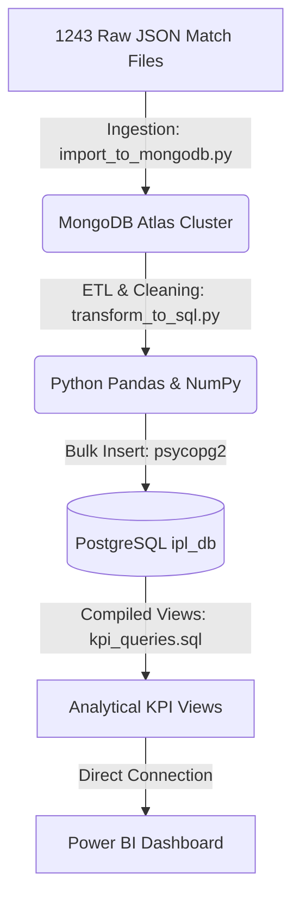
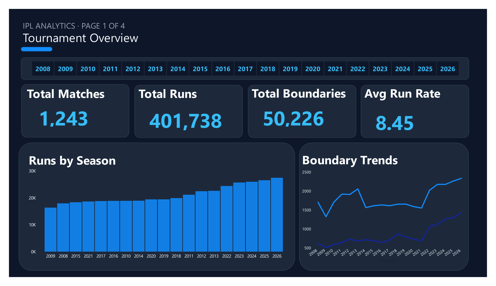
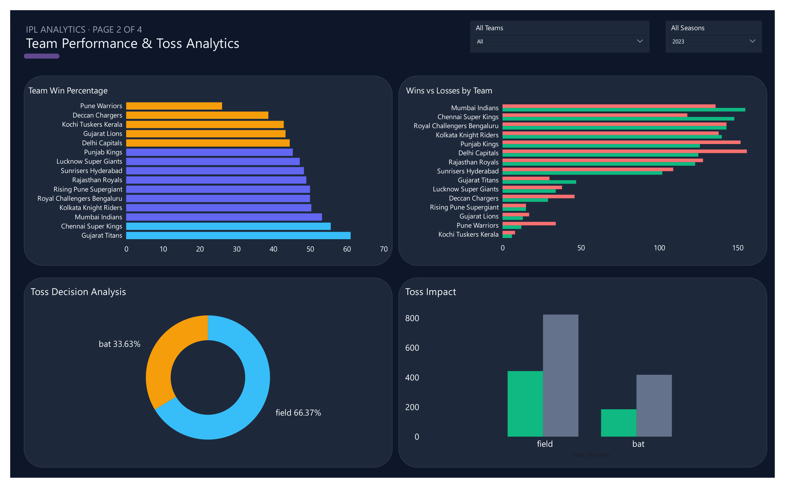
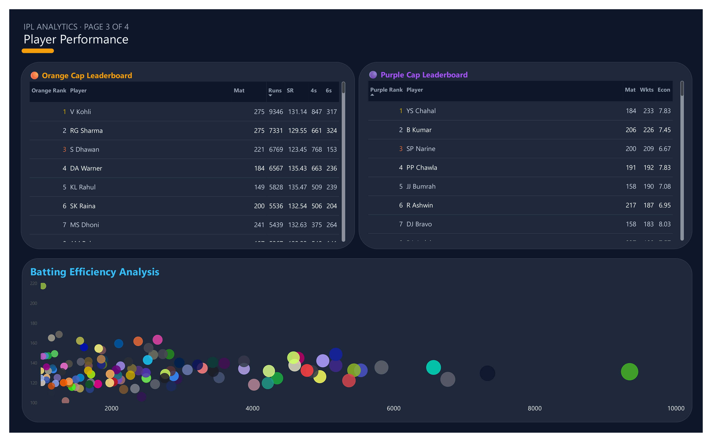
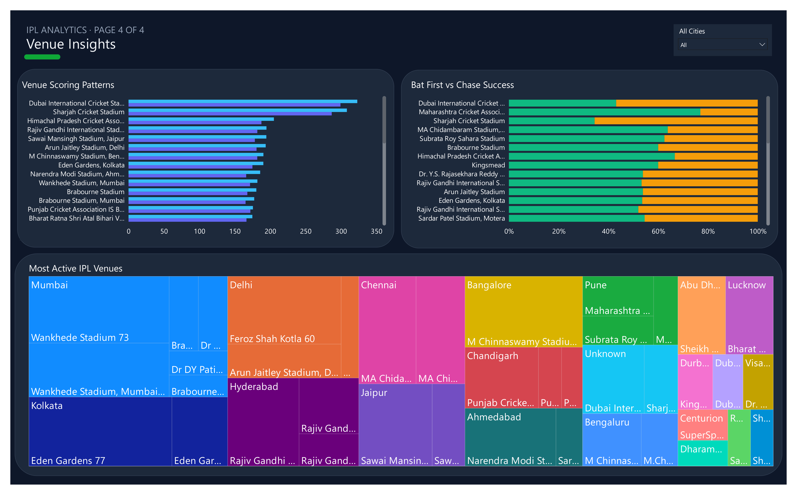

# IPL End-to-End Data Analytics Project

This project demonstrates a complete end-to-end data engineering and analytics pipeline for **Indian Premier League (IPL)** match data spanning from 2008 to 2026. The pipeline ingests unstructured raw JSON match data, stores it in a NoSQL database, transforms and cleans it into a relational SQL database, and builds pre-aggregated SQL views for high-performance reporting in **Power BI**.

---

## 🛠️ Tech Stack & Tools
*   **Data Cleaning & Transformation**: Python (Pandas, NumPy)
*   **NoSQL Database (Raw Storage)**: MongoDB Atlas
*   **Relational Database (Structured Warehouse)**: PostgreSQL 18
*   **ETL Connection Libraries**: `pymongo`, `psycopg2-binary`, `python-dotenv`
*   **Reporting & Interactive Dashboards**: Power BI

---

## 📐 Data Architecture



---

## 🗄️ Database Schema Design (PostgreSQL)

We model the ball-by-ball tournament data into two highly optimized relational tables:

### 1. `matches` Table
Holds metadata for each of the 1,243 matches:
*   `match_id` (INT, Primary Key): Unique match ID.
*   `season` (VARCHAR): Normalized 4-digit calendar year of the match.
*   `date` (DATE): Date of the match.
*   `team1` / `team2` (VARCHAR): Competing team names (normalized).
*   `toss_winner` (VARCHAR): Team that won the toss.
*   `toss_decision` (VARCHAR): Toss choice ('bat' or 'field').
*   `winner` (VARCHAR): Match winner.
*   `result` (VARCHAR): Outcome classification ('runs', 'wickets', 'tie', 'no result').
*   `result_margin` (INT): Victory margin.
*   `player_of_match` (VARCHAR): Player awarded Man of the Match.
*   `venue` (VARCHAR): Stadium name.
*   `city` (VARCHAR): Location city (imputed from venue if missing in source).

### 2. `deliveries` Table
Holds granular ball-by-ball details (295,732 rows):
*   `delivery_id` (SERIAL, Primary Key): Unique auto-increment ball ID.
*   `match_id` (INT, Foreign Key): Links to `matches(match_id)`.
*   `inning` (INT): Inning index (1, 2, or super over).
*   `batting_team` / `bowling_team` (VARCHAR): Active teams.
*   `over` (INT): Over number (0-indexed, 0-19).
*   `ball` (INT): Ball number in the over (1-indexed).
*   `batter` / `bowler` / `non_striker` (VARCHAR): Player involvements.
*   `batsman_runs` (INT): Runs scored by the batter.
*   `extra_runs` (INT): Extra runs from wides, no-balls, byes, etc.
*   `total_runs` (INT): Total runs scored on the delivery.
*   `is_wicket` (INT): Boolean flag (0 or 1) indicating a dismissal.
*   `dismissal_kind` (VARCHAR): Type of dismissal (e.g., caught, bowled, lbw).
*   `player_dismissed` (VARCHAR): Name of the dismissed player.
*   `fielder` (VARCHAR): Associated fielder(s) involved in the dismissal.
*   `extra_type` (VARCHAR): Type of extra ('wides', 'noballs', 'byes', 'legbyes', 'penalty').

---

## 📈 Compiled SQL KPI Views
We pre-aggregate metrics into 6 database views inside PostgreSQL to optimize Power BI query performance:

1.  **`vw_team_performance`**: Matches played, wins, losses, and overall win percentage per team.
2.  **`vw_orange_cap`**: Top run-scorers overall with matches played, strike rates, and boundary volumes (fours/sixes).
3.  **`vw_purple_cap`**: Leading wicket-takers (excluding run-outs/retired hurt) with matches played and economy rates.
4.  **`vw_venue_insights`**: Average 1st and 2nd innings scores and win ratios for batting first vs. chasing per stadium.
5.  **`vw_season_trends`**: Run rate, boundary count, and total scoring trends season-on-season.
6.  **`vw_toss_impact`**: Match win rates based on toss decisions.

---

## 🚀 Setup & Execution Guide

### 1. Environment Setup
Clone the repository and initialize a Python virtual environment:
```bash
# Clone repository
git clone <your-repo-link>
cd Indian_Premier_league_Analysis

# Create and activate virtual environment
python -m venv venv
venv\Scripts\activate

# Install dependencies
pip install -r requirements.txt
```

### 2. Configuration (`.env`)
Create a `.env` file in the root directory to store database connection secrets:
```ini
MONGO_URI=mongodb+srv://<username>:<password>@cluster.mongodb.net/
MONGO_DB_NAME=ipl
MONGO_COLLECTION=raw_matches

DB_HOST=localhost
DB_PORT=5432
DB_NAME=ipl_db
DB_USER=postgres
DB_PASSWORD=your_postgres_password
```

### 3. Run Ingestion Pipeline
Ingest raw JSON match files into MongoDB Atlas:
```bash
python scripts/import_to_mongodb.py
```

### 4. Run Transformation & PostgreSQL Loading
Clean data, structure schemas, normalize values (such as correcting inconsistent season years like `"2007/08"` to `"2008"`), and bulk load records to PostgreSQL:
```bash
python scripts/transform_to_sql.py
```

### 5. Compile Analytical Views
Run the SQL scripts in PostgreSQL to build the reporting views:
*(You can run the views creation script via psql or execute it inside pgAdmin / DBeaver).*
```bash
# Example using psql
psql -U postgres -d ipl_db -f queries/kpi_queries.sql
```

---

## 📊 Power BI Dashboard & Visual Showcase

The Power BI dashboard connects directly to the PostgreSQL database `ipl_db` using **Import Mode** to load the pre-calculated database views. The design follows a dark-themed broadcast aesthetic with gold highlight accents.

### 1. Overview & Season Trends

*Tracks overall tournament health KPIs (Matches, Runs, Boundaries) and the rise of overall scoring rates and boundary volumes from 2008 to 2026.*

### 2. Team Performance & Toss Impact

*Visualizes wins leaderboards, win-loss comparison, and charts displaying the exact win bias for teams that win the toss and choose to field.*

### 3. Player Statistics

*Showcases leaderboards for the Orange Cap (Runs, Strike Rates) and Purple Cap (Wickets, Economies) with an interactive scatter plot showing batting efficiency.*

### 4. Venue Insights

*Highlights pitch scoring averages (1st vs 2nd innings) and displays chase-friendly venues vs. defend-heavy venues.*

