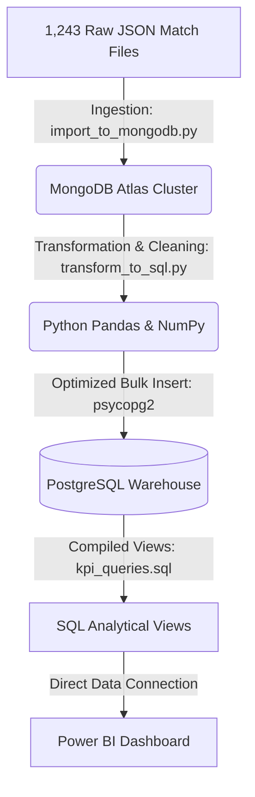

# IPL End-to-End Data Analytics Project

This project implements a complete data pipeline that ingests, cleans, warehouses, and visualizes ball-by-ball Indian Premier League (IPL) match data spanning from 2008 to 2026. The dataset contains 1,243 matches and nearly 300,000 individual delivery records.

The pipeline stores raw unstructured data in a document database, transforms it into a clean star-like relational model in a SQL warehouse, and aggregates key metrics using database views. Finally, these views are imported into Power BI to build an interactive dashboard.

---

## Data Pipeline Architecture



### Design Decisions & System Flow
1.  **Raw Storage (MongoDB Atlas)**: Rather than parsing raw JSON files directly into a relational schema, we first load them as-is into a MongoDB collection. This preserves the raw match hierarchy (dates, match info, overs, deliveries, and wickets) in a single document format, allowing us to rebuild or re-transform the downstream database schema at any time without reprocessing files.
2.  **SQL Warehousing (PostgreSQL)**: Unstructured JSON documents are flattened, cleaned, and structured into a highly efficient relational model. This enables complex analytical querying (aggregations, window functions, and filters) which would be slow or complex to run on raw document structures.
3.  **Database-Layer Aggregation**: Rather than relying on heavy DAX calculations or runtime aggregations inside Power BI, we implement pre-aggregated SQL views. This offloads the computation to PostgreSQL, making the Power BI dashboard load quickly.

---

## Data Inconsistency & Cleaning Challenges

Real-world match logs from 2008 to 2026 contain multiple data discrepancies. During the transformation phase (`transform_to_sql.py`), we solved the following data anomalies:

### 1. Team Rebranding & Variant Names
Over 19 seasons, several franchises rebranded, changed names, or had slightly different representations in the raw files. To prevent skewed statistics (e.g., treating one team as two separate entities), the pipeline normalizes them:
*   `Kings XI Punjab` $\rightarrow$ `Punjab Kings`
*   `Delhi Daredevils` $\rightarrow$ `Delhi Capitals`
*   `Rising Pune Supergiants` $\rightarrow$ `Rising Pune Supergiant`
*   `Royal Challengers Bangalore` $\rightarrow$ `Royal Challengers Bengaluru`

### 2. Mixed Season Format
The raw files used inconsistent representations for seasons, combining date ranges and single years:
*   Ranges: `"2007/08"`, `"2009/10"`, `"2020/21"`
*   Single Years: `"2009"`, `"2011"`, `"2012"`, etc.

The pipeline resolves this by extracting the year directly from the actual match date (e.g., a match in season `"2007/08"` played on `2008-04-18` is normalized to `2008`). This ensures seasons are consistently stored as 4-digit calendar years, making timeline visualizations and filters sort correctly.

### 3. Missing Match Cities
In several matches, the `city` field was missing in the JSON file. The pipeline resolves this by checking the `venue` name and mapping it to the known city (e.g., mapping `"M Chinnaswamy Stadium"` to `"Bangalore"`, `"Wankhede Stadium"` to `"Mumbai"`, and `"Eden Gardens"` to `"Kolkata"`).

---

## Database Relational Model

We divide the match data into two structured tables to enforce integrity and optimize queries:

### 1. `matches` Table
```sql
CREATE TABLE matches (
    match_id INT PRIMARY KEY,
    season VARCHAR(20),
    date DATE,
    team1 VARCHAR(100),
    team2 VARCHAR(100),
    toss_winner VARCHAR(100),
    toss_decision VARCHAR(20),
    winner VARCHAR(100),
    result VARCHAR(50),      -- 'runs', 'wickets', 'tie', 'no result'
    result_margin INT,
    player_of_match VARCHAR(100),
    venue VARCHAR(200),
    city VARCHAR(100)
);
```

### 2. `deliveries` Table
```sql
CREATE TABLE deliveries (
    delivery_id SERIAL PRIMARY KEY,
    match_id INT REFERENCES matches(match_id) ON DELETE CASCADE,
    inning INT,
    batting_team VARCHAR(100),
    bowling_team VARCHAR(100),
    over INT,
    ball INT,
    batter VARCHAR(100),
    bowler VARCHAR(100),
    non_striker VARCHAR(100),
    batsman_runs INT,
    extra_runs INT,
    total_runs INT,
    is_wicket INT,
    dismissal_kind VARCHAR(50),
    player_dismissed VARCHAR(100),
    fielder VARCHAR(100),
    extra_type VARCHAR(50)   -- 'wides', 'noballs', 'byes', 'legbyes', 'penalty'
);
```

---

## Pre-Compiled Analytical SQL Views

We created 6 target database views to serve as clean data sources for the Power BI report:

1.  **`vw_team_performance`**: Tracks matches played, wins, losses, and overall win percentages for each team.
2.  **`vw_orange_cap`**: Lists players with 1,000+ career runs, showing runs, strike rates, matches played, fours, and sixes.
3.  **`vw_purple_cap`**: Lists bowlers with 50+ career wickets, showing wickets, matches played, and economy rates.
4.  **`vw_venue_insights`**: Computes average 1st and 2nd innings scores and win ratios (chasing vs. defending) for stadiums with 10+ matches.
5.  **`vw_season_trends`**: Aggregates runs, boundaries, and run rates year-by-year.
6.  **`vw_toss_impact`**: Checks match outcomes based on toss decisions.

---

## Power BI Dashboard & Visual Showcase

The Power BI dashboard connects directly to your local PostgreSQL instance and imports the pre-compiled views. The layout uses a dark dashboard theme with gold accents for visual hierarchy.

### Page 1: Overview & Season Trends

*Displays tournament-wide KPIs (Matches, Runs, Fours, and Sixes) and tracks season-on-season run rates and boundary totals (fours and sixes) from 2008 to 2026.*

### Page 2: Team Performance & Toss Impact

*Shows a team win percentage leaderboard (led by Gujarat Titans and Chennai Super Kings), win-loss breakdowns, and graphs evaluating toss bias and choices.*

### Page 3: Player Leaderboards

*Orange and Purple Cap list tables detailing top run-scorers (led by Virat Kohli and Rohit Sharma) and wicket-takers, paired with a scatter plot evaluating strike rate vs. runs.*

### Page 4: Venue & Match Insights

*Details pitch behavior by looking at average 1st and 2nd innings scores by stadium, and classifies grounds based on their win bias (defend-friendly stadiums like Chepauk vs. chasing-friendly stadiums like Wankhede).*

---

## Project Setup & Running

### 1. Installation
Clone the repository, create a virtual environment, and install dependencies:
```bash
git clone <your-repository-url>
cd Indian_Premier_league_Analysis

# Set up virtual environment
python -m venv venv
venv\Scripts\activate

# Install libraries
pip install -r requirements.txt
```

### 2. Environment Variables (`.env`)
Create a `.env` file at the root of the project to configure your databases:
```ini
MONGO_URI=mongodb+srv://<username>:<password>@cluster.mongodb.net/
MONGO_DB_NAME=ipl
MONGO_COLLECTION=raw_matches

DB_HOST=localhost
DB_PORT=5432
DB_NAME=ipl_db
DB_USER=postgres
DB_PASSWORD=your_postgres_password
```

### 3. Running the Pipeline
Run the ingestion and ETL scripts sequentially:
```bash
# Ingest raw JSON matches into MongoDB Atlas
python scripts/import_to_mongodb.py

# Run transformation, schema creation, cleaning, and load into PostgreSQL
python scripts/transform_to_sql.py

# Create analytical views in PostgreSQL ipl_db database
psql -U postgres -d ipl_db -f queries/kpi_queries.sql
```
Once the ETL is complete, open the Power BI project file located in `PowerBI/IPL_d.pbix` and refresh the data connections to update the reports.
